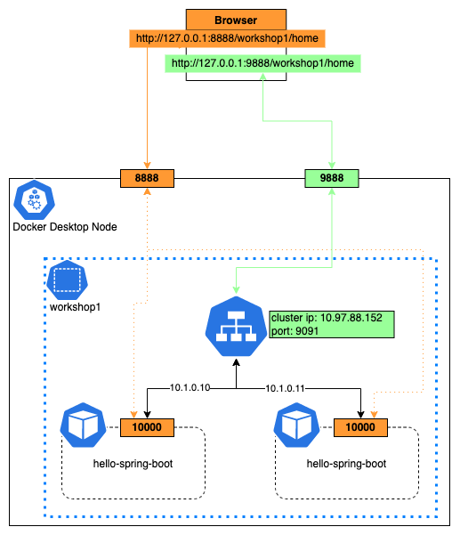

workshop 1 kubernetes architecture



switch kubectl context to docker desktop

```kubectl config use-context docker-desktop```

check kubectl current context

```kubectl config current-context```

list of kubectl contexts

```kubectl config get-contexts```

create hello-kubernetes namespace

```kubectl apply -f ./hello-springboot-namespace.yaml```

You will see 'hello-kubernetes' on lists after execute following command

```kubectl get ns```

Deploy hello-spring-boot application

```kubectl apply -f ./hello-springboot-deployment.yaml```

Watch deployment, `-n` is used to specify namespace, specify the name is *hello-kubernetes*

```kubectl get deployment -n hello-kubernetes --watch```

hello-spring-boot application should be in running status.

```kubectl get pods -n hello-kubernetes --watch```

Access hello-spring-boot application through browser by *port-forward* method

```kubectl port-forward pod/{REPLACE YOUR POD NAME} 8888:10000 -n hello-kubernetes```

An example

```kubectl port-forward --address 0.0.0.0 pod/spring-boot-deployment-59f5d7f8c8-fcl85 8888:10000 -n hello-kubernetes```

Access http://127.0.0.1:8888/sample/home through browser, you should see **Hello, spring-boot-example!** message.

Create a service on hello-spring-boot application

```kubectl apply -f ./hello-spring-boot-service.yaml```

Describe spring-boot-service to view more information, etc IP, Type, Endpoints...

```kubectl describe service spring-boot-service -n hello-kubernetes```

Access hello-spring-boot application through spring-boot-service

```kubectl port-forward service/spring-boot-service 9888:9091 -n hello-kubernetes```

Access http://127.0.0.1:9888/sample/home through browser, you should see **Hello, spring-boot-example!** message.