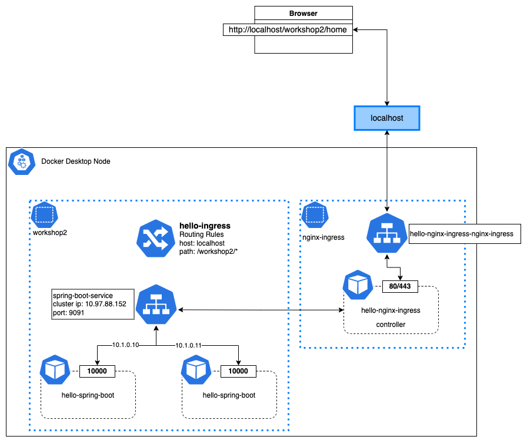

workshop 2 kubernetes architecture



Create workshop2 namespace

```kubectl apply -f ./workshop2/hello-springboot-namespace.yaml```

Create nginx-ingress namespace

```kubectl apply -f ./workshop2/nginx-ingress-namespace.yaml```

Check workshop2, nginx-ingress on list

```kubectl get ns```

Install nginx ingress controller, after that, Two kubernetes components are deployed in namespace nginx-ingress, one is pod:hello-nginx-ingress controller , the other one is service:hello-nginx-ingress-nginx-ingress.

```helm install hello-nginx-ingress nginx-stable/nginx-ingress -n nginx-ingress```

Check hello-nginx-ingress controller pod in running status.

```kubectl get pods -n nginx-ingress```

View service hello-nginx-ingress-nginx-ingress details

```kubectl describe service hello-nginx-ingress-nginx-ingress -n nginx-ingress```

Deploy hello-spring-boot application with workshop2 namespace

```kubectl apply -f ./workshop2/hello-springboot-deployment.yaml```

Check hello-spring-boot pods in running status.

```kubectl get pods -n workshop2 --watch```

Create a service for hello-spring-boot application

```kubectl apply -f ./workshop2/hello-spring-boot-service.yaml```

Watching hello-nginx-ingress logs to see details

```kubectl logs {POD} -n nginx-ingress -f```

An example

```kubectl logs hello-nginx-ingress-nginx-ingress-6d99d9ddd7-c29pz -n nginx-ingress -f```

Create a routing rule, the routing targets to spring-boot-service

```kubectl apply -f ./workshop2/hello-ingress.yaml```

Access http://localhost/workshop2/home through browser, you should see **Hello, spring-boot-example!** message.
